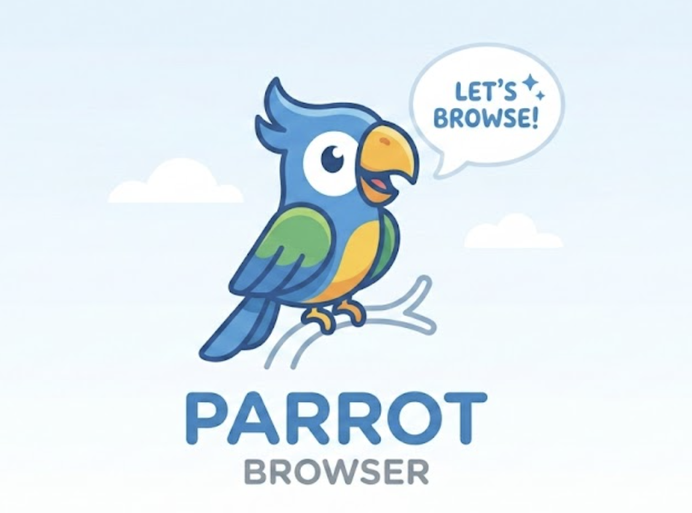

<p align="center">
  
</p>

<h1 align="center">🦜 Parrot Browser 🦜</h1>

A [Model Context Protocol](https://modelcontextprotocol.io/) (MCP) server that provides browser automation capabilities using [Playwright](https://playwright.dev). This server enables LLMs to interact with web pages through structured accessibility snapshots.

> **Note:** This is a fork of [microsoft/playwright-mcp](https://github.com/microsoft/playwright-mcp), licensed under Apache 2.0.

## Quick Start

Add to your MCP client configuration:

```json
{
  "mcpServers": {
    "parrot-browser": {
      "command": "npx",
      "args": ["parrot-browser"]
    }
  }
}
```

## Install & Setup

```bash
npm install
npx playwright install
```

## Running Tests

```bash
npm test          # Run all tests
npm run ctest     # Run Chrome tests only
```

## Configuration

See [`config.d.ts`](./config.d.ts) for the full configuration schema.

## CLI Usage

```bash
npx parrot-browser [options]
```

Options:
- `--browser <browser>` — Browser to use (`chrome`, `firefox`, `webkit`, `chromium`, `msedge`)
- `--headless` — Run in headless mode
- `--config <path>` — Path to configuration file

## License

Apache 2.0 — see [LICENSE](./LICENSE) and [NOTICE](./NOTICE).
